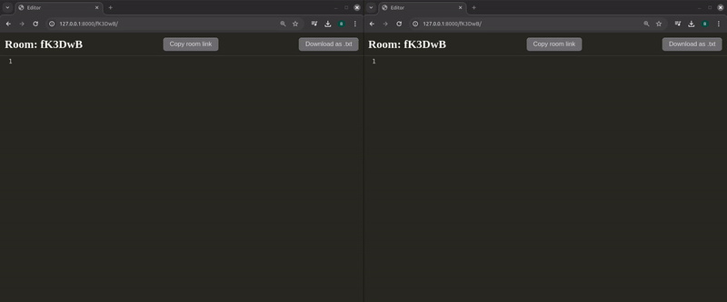

### Overview



### Use Cases

- **Pair Programming**: Allows two developers to work on the same codebase simultaneously.
- **Interviews**: Conduct coding interviews with candidates in real-time.
- **Teaching**: Useful for coding bootcamps or online courses to provide hands-on coding sessions.
- **Troubleshooting**: Collaborate with a colleague to debug and solve coding issues in real-time.

## Installation Guide

### Prerequisites

- Python 3.x
- pip (Python package installer)
- git (version control system)

### Installation Steps

1. **Clone the Repository**

   ```bash
   git clone https://github.com/yourusername/real-time-code-editor.git
   cd real-time-code-editor ```
2. **Create a Virtual Environment**

   ```bash
   python -m venv venv
   ```
3. **Activate the Virtual Environment**
   
   **For Windows**
   
   ```bash
    venv\Scripts\activate
   ```

   **For MacOS/Linux**
   ```bash
   source venv/bin/activate
   ```
5. **Install the Required Libraries**

   ```bash
   pip install -r requirements.txt
   ```

6. **Apply Database Migrations**

   ```bash
   python manage.py makemigrations
   python manage.py migrate
   ```
7. **Run the Development Server**

   ```bash
   python manage.py runserver
   ```


   
